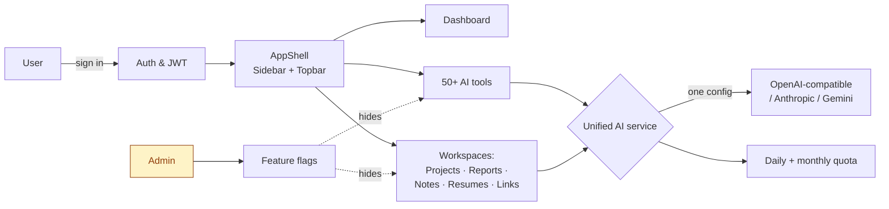
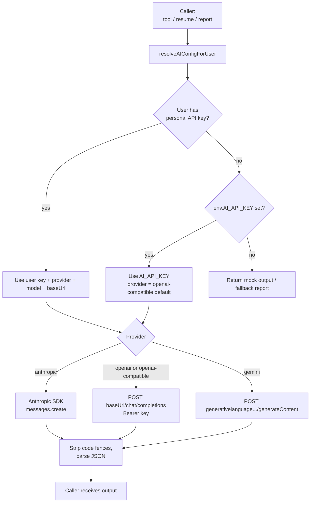
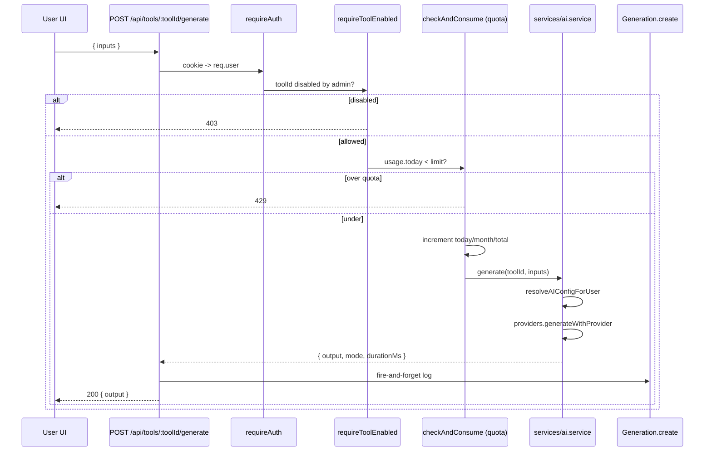
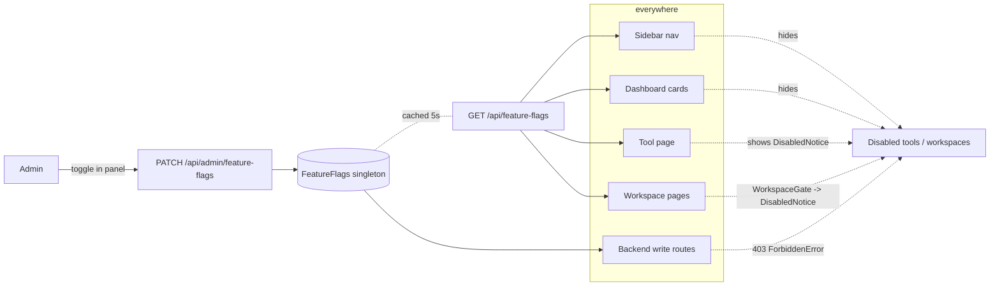
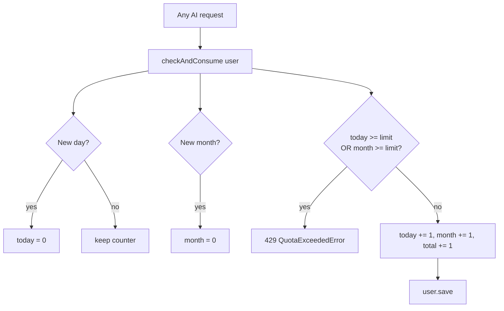
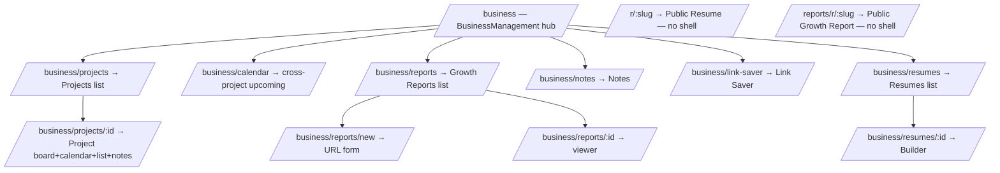
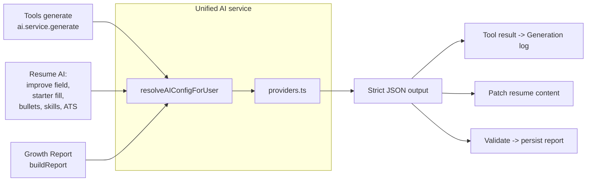
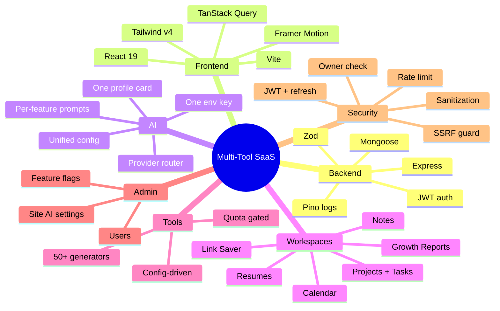

# Multi-Tool SaaS — Full Architecture Overview

This is the single-source-of-truth doc for the whole app: **what it is, what it does, how big it is, how the AI runs through it, how the folders are organized, and how to extend it.** Every flow has a Mermaid diagram so you can see it at a glance.

If you only have 30 seconds: this is a **multi-tenant AI SaaS** with one unified AI provider (any OpenAI-compatible endpoint), 50+ generators, 6 first-party workspaces (Projects, Calendar, Reports, Notes, Link Saver, Resumes), per-user data isolation, daily/monthly quotas, and a global admin feature-flag system that hides tools and workspaces site-wide.

---

## 1. What this app is

A **monorepo Node/Express + MongoDB backend** and a **React 19 + Vite + Tailwind v4 frontend**. Users sign in (email/password or Google), pick a tool or workspace, and AI generates output. Admin controls what the whole site shows.

### Hard numbers (current state)

| Metric | Count |
|---|---|
| AI generators | **50+** (across 6 categories) |
| Workspaces | **6** (Projects, Calendar, Growth Reports, Notes, Link Saver, Resumes) + Dashboard + Business Ideas catalog |
| Backend route files | 11 (auth, tools, user, admin, business, resume, report, public report, public resume, short link, feature flags) |
| Mongoose models | 10 (User, Settings, FeatureFlags, Project, Task, Note, Generation, Resume, GrowthReport, ShortLink) |
| Frontend pages | 20+ |
| Export formats (Growth Reports) | 7 (PDF, DOCX, PPTX, XLSX, HTML, CSV, TXT) |
| Export formats (Resumes) | 2 (PDF, DOCX) |
| Resume templates | 6 (Modern, Classic, Minimal, Creative, Compact, Executive) |

---

## 2. The 30-second mental model



---

## 3. Tech stack

### Backend (`backend/`)
- **Runtime**: Node 20+, ES modules (`"type": "module"`)
- **Framework**: Express 4 + TypeScript strict
- **Database**: MongoDB via Mongoose 8
- **Auth**: JWT (access + refresh cookies) + optional Google OAuth
- **AI providers**: One unified config calling Anthropic SDK *or* any OpenAI-compatible REST endpoint *or* Gemini REST
- **Document export**: `docx`, `@react-pdf/renderer` (resumes), `pptxgenjs`, `exceljs`, `jspdf` (reports — front-end side)
- **Security**: `helmet`, `cors`, `cookie-parser`, request IDs, structured logging via `pino`
- **Validation**: Zod on every input

### Frontend (`client/`)
- **Build**: Vite 8 + React 19
- **Styling**: Tailwind v4 with semantic CSS tokens (`bg-card`, `text-muted-foreground`, etc.)
- **UI**: shadcn-style primitives (Button, Card, Dialog, Popover, Select, Input, Textarea, Label) + Framer Motion for animations
- **Data**: TanStack Query (cache, polling, mutations) + Zustand (auth store)
- **Routing**: React Router 7
- **Forms**: React Hook Form + Zod resolvers (where multi-field)
- **A11y**: Radix primitives, `prefers-reduced-motion` respected

---

## 4. Folder structure (starter map)

### Top level
```
multi-tool-saas/
├── backend/           # Node + Express + Mongoose
├── client/            # React + Vite
└── docs/              # Architecture + per-feature docs
```

### `backend/src/`
```
backend/src/
├── app.ts                          # Express app factory (helmet, cors, routes)
├── server.ts                       # boot + DB connect + listen
├── config/
│   ├── env.ts                      # Zod env schema (ONE AI_API_KEY)
│   ├── ai.config.ts                # provider enum + default model map
│   ├── database.ts                 # mongoose.connect()
│   ├── logger.ts                   # pino instance
│   ├── tools.config.ts             # composes all tool definitions
│   └── tools/                      # one file per category
│       ├── marketing.ts
│       ├── business.ts
│       ├── design.ts
│       ├── video.ts
│       ├── local.ts
│       ├── quick.ts
│       ├── shared.ts               # shared input shapes
│       └── types.ts
├── middleware/
│   ├── auth.middleware.ts          # requireAuth, requireAdmin, optionalAuth
│   ├── featureFlag.middleware.ts   # requireToolEnabled, requireWorkspaceEnabled
│   ├── validate.middleware.ts      # Zod -> 400 helper
│   ├── error.middleware.ts         # global error handler
│   ├── rateLimit.middleware.ts     # express-rate-limit
│   └── requestId.middleware.ts
├── models/                         # Mongoose schemas
│   ├── User.model.ts               # with aiSettings sub-doc
│   ├── Settings.model.ts           # site-wide AI defaults (admin)
│   ├── FeatureFlags.model.ts       # singleton — disabled tools + workspaces
│   ├── Project.model.ts
│   ├── Task.model.ts
│   ├── Note.model.ts
│   ├── Generation.model.ts         # AI tool history
│   ├── Resume.model.ts
│   ├── GrowthReport.model.ts
│   └── ShortLink.model.ts
├── validators/                     # Zod schemas — one per route group
│   ├── auth.validator.ts
│   ├── admin.validator.ts
│   ├── business.validator.ts
│   ├── tools.validator.ts
│   ├── user.validator.ts
│   ├── resume.validator.ts
│   ├── report.validator.ts
│   └── featureFlags.validator.ts
├── controllers/                    # Pure HTTP handlers (asyncHandler wrap)
│   ├── auth.controller.ts
│   ├── admin.controller.ts
│   ├── user.controller.ts
│   ├── business.controller.ts
│   ├── tools.controller.ts
│   ├── resume.controller.ts
│   ├── report.controller.ts
│   ├── featureFlags.controller.ts
│   └── shortLink.controller.ts
├── routes/                         # Just method+path -> controller wiring
│   ├── index.ts                    # mounts everything
│   ├── auth.routes.ts
│   ├── tools.routes.ts             # + requireToolEnabled
│   ├── user.routes.ts
│   ├── admin.routes.ts             # + feature-flag endpoints
│   ├── business.routes.ts          # + requireWorkspaceEnabled per group
│   ├── resume.routes.ts
│   ├── publicResume.routes.ts
│   ├── report.routes.ts
│   └── publicReport.routes.ts
├── services/                       # Domain logic — no HTTP, no Express
│   ├── ai.service.ts               # generic tool generation
│   ├── ai/
│   │   ├── config.ts               # ONE: env + per-user resolver
│   │   ├── providers.ts            # Anthropic / OpenAI-compatible / Gemini
│   │   └── prompt-builder.ts       # tool -> system/user prompts
│   ├── auth.service.ts             # JWT sign/verify, password hash
│   ├── usage.service.ts            # quota check + consume
│   ├── linkPreview.service.ts      # OG meta scraper for Link Saver
│   ├── google.service.ts           # Google OAuth verify
│   ├── resume/                     # AI prompts + DOCX + PDF render
│   │   ├── resume.ai.ts
│   │   ├── resume.prompts.ts
│   │   ├── docxExporter.ts
│   │   └── pdfExporter.ts          # @react-pdf/renderer, 6 templates
│   └── report/                     # Scraper + AI report builder
│       ├── scraper.ts              # SSRF-guarded HTTP fetch
│       ├── fallback.ts             # deterministic genre detector
│       ├── prompts.ts
│       ├── generator.ts            # AI -> JSON -> validate
│       └── index.ts                # orchestrator (queued -> completed)
├── types/                          # Ambient .d.ts
└── utils/
    ├── asyncHandler.ts             # next(err) on rejection
    ├── errors.ts                   # AppError hierarchy
    └── responses.ts                # ok() / created() helpers
```

### `client/src/`
```
client/src/
├── main.tsx                        # mount + QueryClientProvider + Router
├── App.tsx                         # routes + WorkspaceGate wrappers
├── index.css                       # Tailwind + design tokens
├── pages/                          # one default-export per route
│   ├── Landing.tsx
│   ├── Login.tsx / Register.tsx / VerifyEmail.tsx
│   ├── Dashboard.tsx               # shortcut cards
│   ├── BusinessManagement.tsx      # workspaces hub
│   ├── Business.tsx                # /business/projects
│   ├── Project.tsx                 # one project detail
│   ├── BusinessNotes.tsx
│   ├── BusinessLinkSaver.tsx
│   ├── BusinessIdeas.tsx           # tools catalog
│   ├── CategoryPage.tsx            # one tool category
│   ├── Tool.tsx                    # one tool generator UI
│   ├── Resumes.tsx                 # resumes list
│   ├── ResumeBuilderPage.tsx
│   ├── PublicResume.tsx            # /r/:slug, no shell
│   ├── PublicReport.tsx            # /reports/r/:slug, no shell
│   ├── business/
│   │   ├── ReportsListPage.tsx
│   │   ├── NewReportPage.tsx
│   │   ├── ReportViewerPage.tsx
│   │   └── BusinessCalendarPage.tsx
│   ├── History.tsx                 # past generations
│   ├── Profile.tsx                 # user account + AI settings card
│   ├── Admin.tsx                   # users + feature flags
│   └── NotFound.tsx
├── components/
│   ├── layout/                     # AppShell, Sidebar, Topbar
│   ├── ui/                         # primitives (button, card, dialog…)
│   ├── common/                     # PageTransition, LoadingDots,
│   │                               #   DisabledNotice, WorkspaceGate
│   ├── auth/                       # OAuth button etc.
│   ├── landing/                    # landing page sections
│   ├── tools/                      # ToolPage + ToolCard
│   ├── business/                   # ProjectDialog, TaskDialog, board, calendar,
│   │   │                           #   reports/, BusinessTabs, BusinessLayout
│   │   └── reports/                # ReportCard, viewer/, ShareDialog…
│   ├── resume/                     # ResumeBuilder + templates/ + ai/ + sections/
│   ├── admin/                      # FeatureFlagsPanel
│   └── profile/                    # AiSettingsCard
├── hooks/
│   ├── useAuth.ts
│   ├── useTheme.ts
│   ├── useTools.ts
│   └── useFeatureFlags.ts          # global feature-flag reader
├── lib/
│   ├── api.ts                      # axios + 401 refresh interceptor
│   ├── utils.ts                    # cn() classNames
│   ├── tool-icons.ts               # tool id -> Lucide icon
│   ├── queries.ts                  # all generic queries
│   ├── business.api.ts / .queries.ts
│   ├── resume.api.ts / .queries.ts
│   ├── reports.api.ts / .queries.ts
│   ├── reports.exporters.ts        # 7 export formats
│   ├── featureFlags.api.ts
│   ├── query-scope.ts              # cache key user-scoping
│   └── user-storage.ts             # scoped localStorage
├── stores/
│   └── auth.store.ts               # Zustand auth state
└── types/                          # shared TS types
    ├── api.ts
    ├── business.ts
    ├── resume.ts
    ├── reports.ts
    └── featureFlags.ts
```

---

## 5. The Unified AI Service — how every AI call flows

This is the single most important diagram in the app. **Every** AI feature (tool generators, resume AI, growth reports) uses the same path.



### "One AI service" — what that means in practice
- **One env variable**: `AI_API_KEY`. That's the entire site-wide fallback. Old multi-key chain (`ANTHROPIC_API_KEY`, `OPENAI_API_KEY`, `GEMINI_API_KEY`) is gone.
- **One profile card** (`AiSettingsCard.tsx`): one API key field, one model field, one endpoint type (defaults to **OpenAI-compatible**), one optional base URL. Whatever you save here drives every AI feature.
- **One resolver** (`services/ai/config.ts`): user key wins, else env key, else mock output.
- **One provider router** (`services/ai/providers.ts`): switch on `provider` to call Anthropic / OpenAI-compatible / Gemini.

Why keep the provider switch at all? Because Anthropic and Gemini have different request shapes than OpenAI. The `openai-compatible` setting is the universal one — point it at OpenRouter, Groq, Together, Ollama, or OpenAI itself with one base URL change.

---

## 6. Tool generation flow (the 50+ generators)



---

## 7. Feature Flags — global hide controls

Admin can disable any tool by id and any workspace by key. The flag is **global** — affects every user. Admins themselves are exempt so they can still manage content after hiding.



Workspace keys: `ideas`, `projects`, `calendar`, `notes`, `link-saver`, `resumes`, `reports`.

---

## 8. Quota & isolation



**Plans**: `free` (env-tunable), `pro` (500/day, 10k/mo), `team` (2k/day, 50k/mo).

**Data isolation**: every model has `user: ObjectId` indexed, every authed query filters by `{ user: req.user._id }`. The frontend cache keys are user-scoped via `scopeKey(userId)` so logging out as user A and in as user B cannot show A's cached data. See `docs/data-isolation-flow.md`.

---

## 9. Workspace map



Tabs strip (`BusinessTabs`) shows **Projects · Calendar** across all `/business/*` pages and persists the active tab to `localStorage["business:activeTab"]`.

---

## 10. Per-feature flow summaries

### Growth Reports
Full doc: [growth-reports.md](./growth-reports.md)

Short version: paste URL → backend scrapes (SSRF-guarded) → AI builds JSON report (12 sections, 5 revenue streams, 4 scores) → frontend polls every 2s → viewer renders → 7 export formats run in-browser.

### Resumes
6 templates (Modern / Classic / Minimal / Creative / Compact / Executive), React Hook Form-driven builder, 800ms debounced autosave with in-flight queue, AI assists (improve field / generate bullets / suggest skills / ATS check / starter fill from a bio), DOCX export via `docx`, PDF export via `@react-pdf/renderer` with 6 dedicated PDF renderers (one per template). Optional share slug → `/r/:slug` public page.

### Projects & Tasks
Mongoose `Project` + `Task` (with checklist sub-doc + tags + position for drag ordering). Board view uses `@dnd-kit`. Calendar reuses the same task data, grouped by `dueDate`. Notes are stand-alone with optional `project`/`task` linkage.

### Link Saver
Backend `linkPreview.service.ts` fetches OG meta from a URL, returns title/description/image/favicon. Stored as a Note with a custom shape.

### History
Every successful tool generation writes to `Generation` (soft delete via `status: "active" | "deleted"`). Profile and Dashboard read from this collection for "Recent generations".

---

## 11. Routing summary — backend

| Mount | File | Notes |
|---|---|---|
| `/api/auth/*` | `auth.routes.ts` | login / register / refresh / google / verify-email |
| `/api/tools` (read), `/api/tools/:id/generate` | `tools.routes.ts` | generate gated by `requireToolEnabled` |
| `/api/user/*` | `user.routes.ts` | usage, history, ai-settings |
| `/api/admin/*` | `admin.routes.ts` | users, stats, settings, feature-flags |
| `/api/business/*` | `business.routes.ts` | projects/tasks/notes — each group gated by workspace |
| `/api/business/resumes/*` | `resume.routes.ts` | gated by `resumes` workspace |
| `/api/business/reports/*` | `report.routes.ts` | gated by `reports` workspace |
| `/api/public/resumes/:slug` | `publicResume.routes.ts` | no auth |
| `/api/public/reports/:slug` | `publicReport.routes.ts` | no auth |
| `/api/feature-flags` | `routes/index.ts` | authed read for UI |

---

## 12. How to extend — recipes

### Add a new AI tool
1. Append a `ToolDefinition` to the matching file in `backend/src/config/tools/`. Provide `id`, `name`, `category`, `description`, `inputs[]`, and `prompt.outputFields[]` + `prompt.instructions[]`.
2. (Optional) Add a custom Lucide icon mapping in `client/src/lib/tool-icons.ts`.
3. Done. The frontend `Tool.tsx` + `ToolPage` component is generic — it renders any tool from the config. Generation hits `/api/tools/:toolId/generate` and goes through the unified AI service.

### Add a new workspace
1. Add a new `WorkspaceKey` literal in `backend/src/models/FeatureFlags.model.ts` (`ALL_WORKSPACE_KEYS`).
2. Mirror it in `client/src/types/featureFlags.ts` (`ALL_WORKSPACE_KEYS` + `WORKSPACE_LABELS`).
3. Build the backend routes/controllers/models for the workspace.
4. Apply `requireWorkspaceEnabled("yourKey")` on the routes.
5. Add a route in `App.tsx` wrapped in `<WorkspaceGate workspace="yourKey">…</WorkspaceGate>`.
6. Add a `BUSINESS_SUB_ITEMS` entry in `Sidebar.tsx` with `workspace: "yourKey"`.
7. Add a shortcut card to `Dashboard.tsx`'s `SHORTCUTS` array with `workspace: "yourKey"`.

The admin panel automatically picks up the new key from `ALL_WORKSPACE_KEYS` — no admin code change needed.

### Add a new export format to Growth Reports
1. Add a function in `client/src/lib/reports.exporters.ts` that takes `(content, websiteUrl, branding)` and triggers a browser download.
2. Add an item to `ITEMS` in `components/business/reports/ReportExportMenu.tsx`.

### Switch AI providers without code changes
- In **Profile → AI service**, set:
  - Endpoint type: `OpenAI-compatible (recommended)`
  - API key: paste any OpenRouter / Groq / Together / Ollama / OpenAI key
  - Model: e.g. `openai/gpt-4.1-mini`, `meta-llama/llama-3.3-70b-instruct`, etc.
  - Base URL: e.g. `https://openrouter.ai/api/v1`
- Or in `.env`: set `AI_API_KEY=…` and `AI_BASE_URL=…` (provider defaults to `openai-compatible`).

---

## 13. How big can this app get?

This codebase is built for **horizontal growth**, not vertical specialization. Three deliberate choices keep the room to grow:

### a) Tools live in config, not code
Adding a tool is a TypeScript object literal. The 50 tools today could be 500 tomorrow without touching React components or controllers.

### b) Workspaces are pluggable
Every workspace declares a key, gets a flag toggle, gets an enforcement gate, gets a sidebar entry — the pattern repeats. New workspaces (CRM, invoicing, social scheduler, podcast generator) drop in cleanly.

### c) One AI surface
Because every AI call goes through `resolveAIConfigForUser → providers.generateWithProvider`, you can:
- Swap providers globally with one env change.
- Add a new provider (e.g. native Mistral) by adding one switch case in `providers.ts`.
- Add per-user keys for cost attribution without changing any call site.

### Scale ceilings to plan for

| Layer | Soft limit | Hardening when you cross it |
|---|---|---|
| Mongo | Single primary handles ~10k users / 1M docs easily | Move to replica set + sharded `Generation` collection |
| Quota | In-doc counters with day/month reset on save | Move to Redis if you ever do >100 generations / user / day |
| Reports queue | Fire-and-forget in-process | Add BullMQ + Redis when generations exceed ~30s or volume grows |
| Exports | Browser-side via jspdf/exceljs/pptxgenjs | Move heavy formats server-side once bundle >5MB |
| Auth | Cookie JWT + refresh | Add device list + session table when you need revocation |
| Feature flags | Singleton + 5s in-process cache | Move to Redis pub/sub if you scale horizontally past 4 nodes |

---

## 14. How AI is woven through the app (every entry point)



Every AI feature follows the same contract:
1. Build `system` + `user` prompts (per-feature `prompts.ts`).
2. Call `generateWithProvider(config, system, user)`.
3. Parse the returned text as JSON (with code-fence tolerance).
4. Validate the shape; if any field is missing or empty, fall back to safe defaults.
5. Persist the result + log token count (when the provider returned one).

---

## 15. Security recap

- **JWT** access token (15m default) in HttpOnly cookie + refresh token (7d) — silent refresh on 401.
- **Owner check** on every authed read/write: `findOne({ _id, user: req.user._id })` and `404` (not `403`) on mismatch so you don't leak existence.
- **SSRF guard** on the report scraper: DNS-resolves the host, rejects every private IPv4/IPv6 range including AWS IMDS, re-checks after each redirect, caps body at 200KB, 15s timeout.
- **Helmet + CORS** on every response. `credentials: true` mandatory for cookie auth.
- **Rate limits**: auth endpoints 10/15m, generic API 60/min.
- **Validation**: Zod on every request body, query, and params.
- **HTML sanitization**: report HTML export passes through `DOMPurify` before download.
- **Public routes**: only resume/report share-slug routes are unauthenticated, and disabling share clears the slug so old links 404 immediately.

---

## 16. Where to read more

| Topic | File |
|---|---|
| Per-user data isolation across the stack | `docs/data-isolation-flow.md` |
| Growth Reports deep dive | `docs/growth-reports.md` |
| Per-feature short docs | `docs/features/` |
| Project README | `docs/README.md` |

---

## 17. Build & run

```bash
# backend
cd backend
cp .env.example .env  # set MONGODB_URI, JWT_*_SECRET, AI_API_KEY
npm install
npm run dev           # tsx watch

# frontend (new terminal)
cd client
npm install
npm run dev           # vite

# production builds
cd backend && npm run build && npm start
cd client && npm run build && npm run preview
```

Both sides typecheck clean (`npm run typecheck` / `npx tsc -b --noEmit`) and build clean (`npm run build`).

---

## 18. The shape of "everything"



That's the whole app on one page. Anything you build next slots into one of these branches — and if it doesn't, the workspace pattern in §12 lets you grow a new branch.
