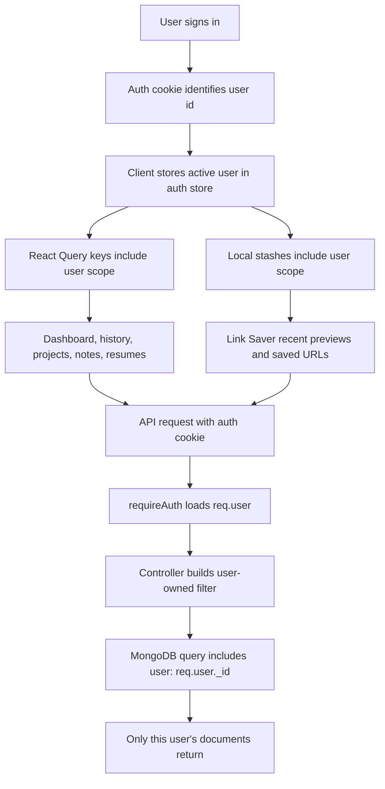

# User Data Isolation Flow

This app keeps user data isolated in three layers:

1. The browser cache and local stashes are scoped by the authenticated user id.
2. API routes require authentication before reading or writing private data.
3. MongoDB queries include `user: req.user._id` for user-owned collections.



## What Changed

- Private React Query buckets now include the user id, for example `business -> userId -> today`.
- On login, logout, auth failure, or account switch, private cached query data is cleared.
- Link Saver local storage moved from global keys to scoped keys like `multitool.user.<id>.business.linkSaver.history`.
- Legacy global Link Saver keys are removed when the page opens, so old shared browser data stops appearing.
- Backend project count updates and note filters now enforce ownership with the logged-in user id.
- Admin user deletion now also deletes that user's projects, tasks, notes, resumes, and generation history.

## Rule Of Thumb

Any new user-owned feature should follow this shape:

```ts
// Client cache
["feature", userId, "resource"]

// Browser storage
multitool.user.<userId>.feature.resource

// Backend query
Model.find({ user: req.user._id, ...filters })
```
