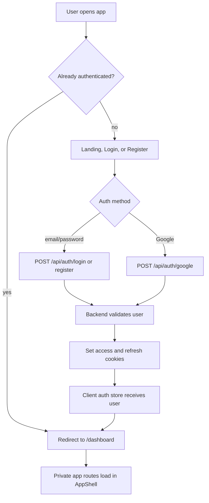

# Authentication

## Feature Description

Authentication lets users register, log in with email/password, log in with Google, refresh their session, verify email, and log out. After a successful login or register flow, the app sends the user to the Dashboard. Auth uses HTTP cookies and `requireAuth` on private API routes.

## Flowchart

## Main Files

| Area | Files |
|---|---|
| Frontend pages | `client/src/pages/Login.tsx`, `client/src/pages/Register.tsx`, `client/src/pages/VerifyEmail.tsx` |
| Frontend forms | `client/src/components/auth/LoginForm.tsx`, `client/src/components/auth/RegisterForm.tsx`, `client/src/components/auth/GoogleButton.tsx` |
| Auth state/API | `client/src/stores/auth.store.ts`, `client/src/lib/queries.ts`, `client/src/lib/api.ts` |
| Backend routes/controllers | `backend/src/routes/auth.routes.ts`, `backend/src/controllers/auth.controller.ts` |
| Backend services/models | `backend/src/services/auth.service.ts`, `backend/src/services/google.service.ts`, `backend/src/models/User.model.ts` |

## Data Rules

- User identity is loaded into `req.user` by auth middleware.
- Private pages require `RequireAuth` in `client/src/App.tsx`.
- Admin-only pages additionally require `RequireAdmin`.
- Login, register, Google login, and root authenticated entry land on `/dashboard`.
