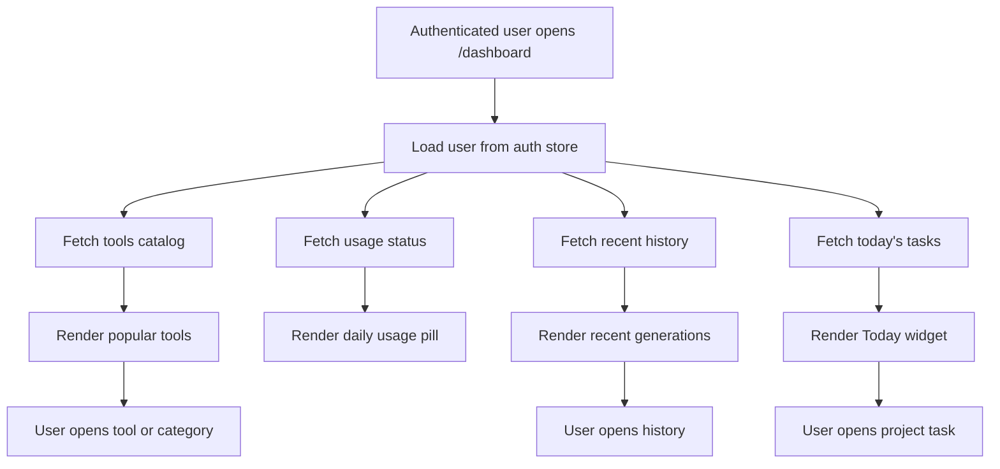

# Dashboard

## Feature Description

The Dashboard is the first authenticated screen. It shows popular tools, today's due tasks, recent generations, category shortcuts, and usage count for the current user.

## Flowchart

## Main Files

| Area | Files |
|---|---|
| Page | `client/src/pages/Dashboard.tsx` |
| Data hooks | `client/src/lib/queries.ts`, `client/src/lib/business.queries.ts` |
| Tool cards/icons | `client/src/components/tools/ToolCard.tsx`, `client/src/lib/tool-icons.ts` |
| Today widget | `client/src/components/business/TodayWidget.tsx` |

## Data Rules

- History query keys include the active user scope.
- Today tasks come from the backend with `user: req.user._id`.
- Dashboard never shows another user's projects, tasks, or generation history.
