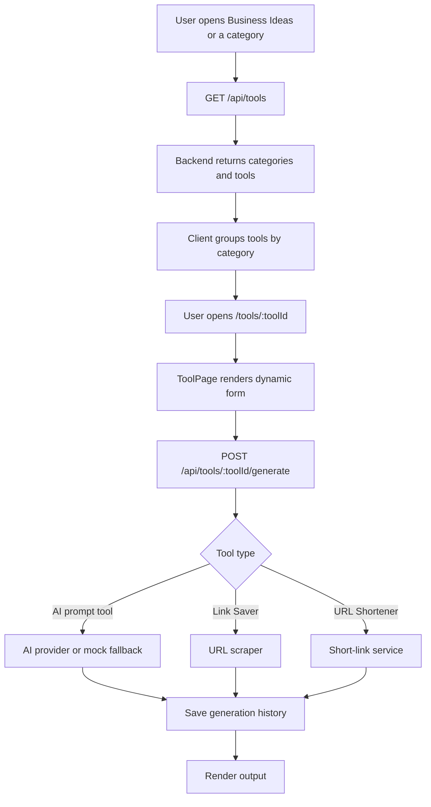

# Tool Catalog

## Feature Description

The Tool Catalog powers Business Ideas, category pages, sidebar tool groups, and `/tools/:toolId`. Most tools are AI prompt tools. Utility tools like Link Saver and URL Shortener run deterministic backend services instead of fake AI output.

## Flowchart

## Main Files

| Area | Files |
|---|---|
| Catalog config | `backend/src/config/tools.config.ts`, `backend/src/config/tools/*` |
| Tool routes/controllers | `backend/src/routes/tools.routes.ts`, `backend/src/controllers/tools.controller.ts` |
| Tool generation | `backend/src/services/ai.service.ts`, `backend/src/services/ai/*` |
| Frontend pages | `client/src/pages/BusinessIdeas.tsx`, `client/src/pages/CategoryPage.tsx`, `client/src/pages/Tool.tsx` |
| Tool UI | `client/src/components/tools/ToolPage.tsx`, `client/src/components/tools/ToolForm.tsx`, `client/src/components/tools/ToolOutput.tsx` |

## Data Rules

- Tool definitions are public.
- Generation is private and requires login.
- Saved generation history is stored with the current user's ID.
