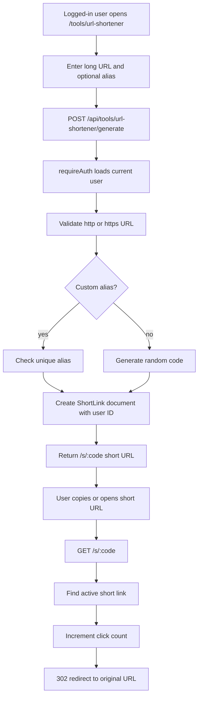

# URL Shortener

## Feature Description

URL Shortener creates a real short URL for the logged-in user. It stores the original URL, generated code or custom alias, owner user ID, and click count in MongoDB. Public short links redirect through `/s/:code`.

## Flowchart

## Main Files

| Area | Files |
|---|---|
| Tool config | `backend/src/config/tools/quick.ts` |
| Short-link model | `backend/src/models/ShortLink.model.ts` |
| Short-link service | `backend/src/services/shortLink.service.ts` |
| Public redirect | `backend/src/controllers/shortLink.controller.ts`, `backend/src/app.ts` |
| Tool generation bridge | `backend/src/services/ai.service.ts`, `backend/src/controllers/tools.controller.ts` |
| Frontend output | `client/src/components/tools/ToolOutput.tsx`, `client/src/lib/tool-icons.ts` |

## Data Rules

- Every created short link stores `user: req.user._id`.
- The public redirect route only needs the code, not login.
- Admin user deletion removes that user's short links.
- Custom aliases are globally unique.
