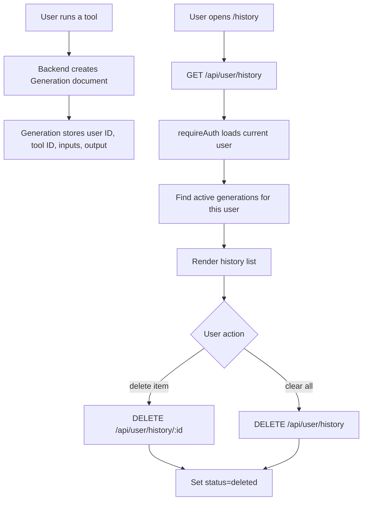

# History

## Feature Description

History shows the logged-in user's tool generations. Users can filter by tool, delete one item, or clear history. Deleted items are soft-deleted with `status: "deleted"`.

## Flowchart

## Main Files

| Area | Files |
|---|---|
| Frontend page | `client/src/pages/History.tsx` |
| Frontend queries | `client/src/lib/queries.ts` |
| Backend controller | `backend/src/controllers/user.controller.ts` |
| Backend routes | `backend/src/routes/user.routes.ts` |
| Model | `backend/src/models/Generation.model.ts` |

## Data Rules

- History reads always filter by `user: req.user._id`.
- Delete and clear operations only affect the current user's records.
- Query cache keys are scoped by active user ID.
