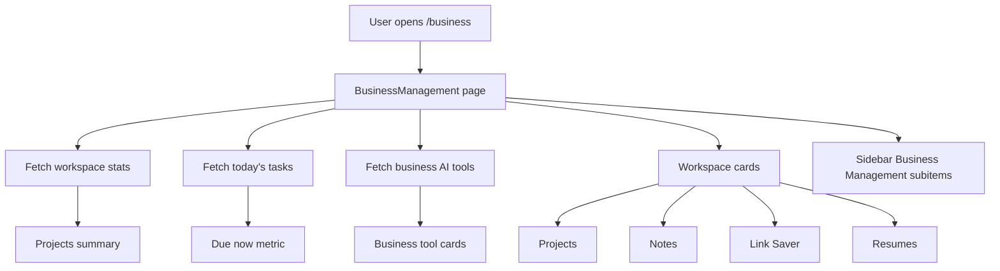

# Business Management

## Feature Description

Business Management is the workspace hub. It links to projects, Growth Reports, notes, Link Saver, resumes, calendar, and business AI tools. The sidebar exposes Business Management as the main section for these features.

## Flowchart

## Main Files

| Area | Files |
|---|---|
| Hub page | `client/src/pages/BusinessManagement.tsx` |
| Sidebar navigation | `client/src/components/layout/Sidebar.tsx` |
| Business queries | `client/src/lib/business.queries.ts`, `client/src/lib/business.api.ts` |
| Backend business API | `backend/src/routes/business.routes.ts`, `backend/src/controllers/business.controller.ts` |

## Data Rules

- Business workspace stats are calculated from the current user's projects and tasks.
- Sidebar links are navigation only; data is loaded by each feature route.
- Growth Reports is available only under the Business Management sidebar section.
