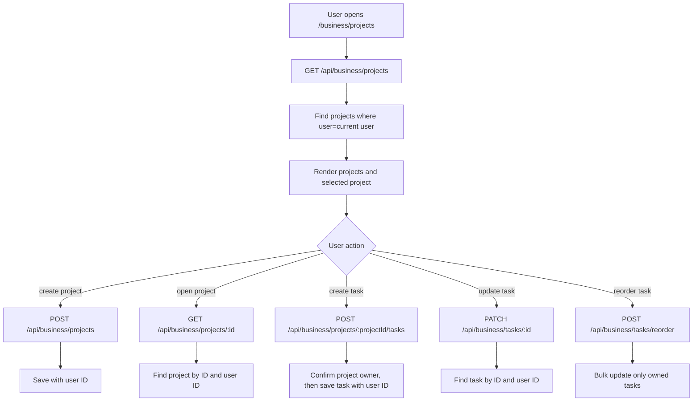

# Projects And Tasks

## Feature Description

Projects and Tasks let each user manage project boards, lists, priorities, due dates, checklists, notes, progress, and project completion counts. All reads and writes are owner-checked.

## Flowchart

## Main Files

| Area | Files |
|---|---|
| Pages | `client/src/pages/Business.tsx`, `client/src/pages/Project.tsx` |
| Layout/components | `client/src/components/business/BusinessLayout.tsx`, `client/src/components/business/ProjectSidebar.tsx`, `client/src/components/business/TaskCard.tsx`, `client/src/components/business/TaskDialog.tsx` |
| Views | `client/src/components/business/views/BoardView.tsx`, `ListView.tsx`, `CalendarView.tsx`, `NotesView.tsx` |
| Backend | `backend/src/routes/business.routes.ts`, `backend/src/controllers/business.controller.ts` |
| Models | `backend/src/models/Project.model.ts`, `backend/src/models/Task.model.ts` |

## Data Rules

- Project, task, checklist, reorder, and delete operations check ownership.
- Project task counts update only when the project belongs to the user.
- Deleting a project also deletes owned tasks and related notes.
