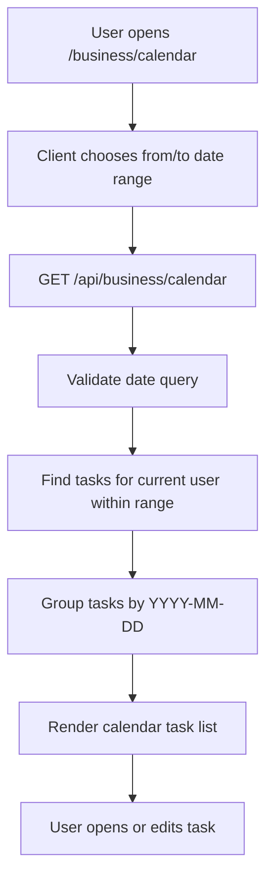

# Calendar

## Feature Description

Calendar shows tasks by due date. It reads the current user's dated tasks and groups them by day for planning.

## Flowchart

## Main Files

| Area | Files |
|---|---|
| Page | `client/src/pages/business/BusinessCalendarPage.tsx` |
| Business hooks | `client/src/lib/business.queries.ts` |
| Date controls | `client/src/components/business/DateTimePicker.tsx` |
| Backend | `backend/src/controllers/business.controller.ts`, `backend/src/routes/business.routes.ts` |
| Model | `backend/src/models/Task.model.ts` |

## Data Rules

- Calendar query filters tasks by `user: req.user._id`.
- Tasks without a due date do not appear in the calendar response.
- Invalid date ranges return a validation error.
