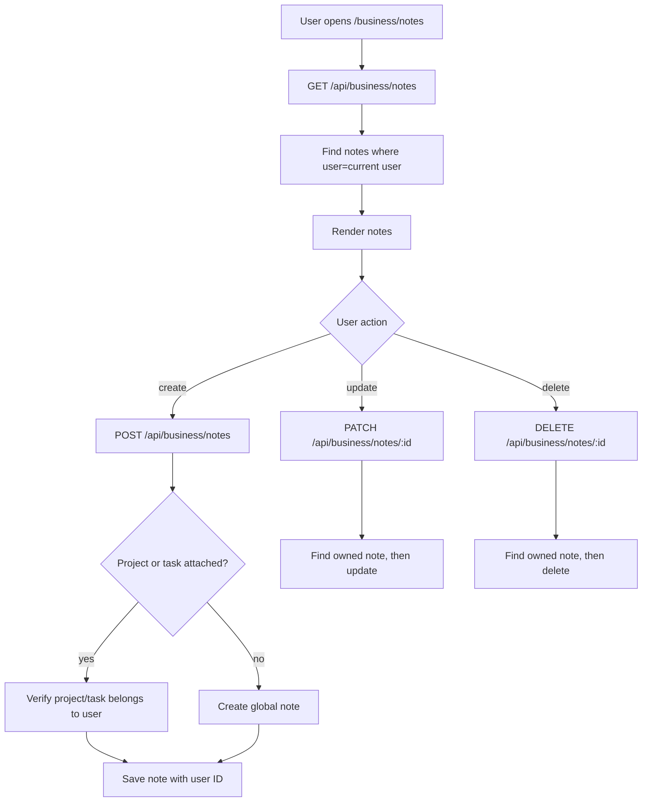

# Notes

## Feature Description

Notes let a user save project notes, task notes, pinned notes, and global notes. Link Saver can create notes from link previews. All notes are private to the user.

## Flowchart

## Main Files

| Area | Files |
|---|---|
| Page | `client/src/pages/BusinessNotes.tsx` |
| Notes UI | `client/src/components/business/NoteDialog.tsx`, `client/src/components/business/views/NotesView.tsx` |
| Client data | `client/src/lib/business.queries.ts`, `client/src/lib/business.api.ts` |
| Backend | `backend/src/controllers/business.controller.ts`, `backend/src/routes/business.routes.ts` |
| Model | `backend/src/models/Note.model.ts` |

## Data Rules

- Every note stores `user`.
- Optional `project` and `task` references are checked before save.
- A user cannot read, update, or delete another user's note.
