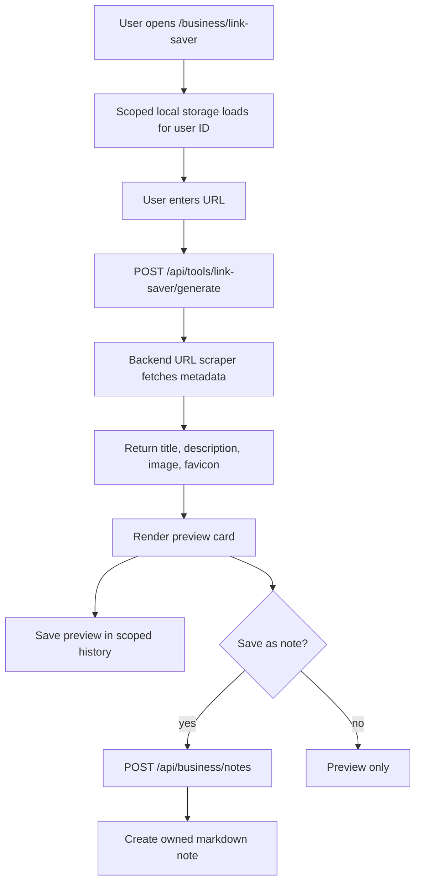

# Link Saver

## Feature Description

Link Saver previews any public URL and lets the user save the preview as a note. Recent previews and saved URL markers are kept in scoped local browser storage, so one account's browser stashes do not leak into another account.

## Flowchart

## Main Files

| Area | Files |
|---|---|
| Page | `client/src/pages/BusinessLinkSaver.tsx` |
| Preview UI | `client/src/components/tools/LinkPreviewCard.tsx` |
| User storage | `client/src/lib/user-storage.ts` |
| Tool bridge | `backend/src/services/ai.service.ts`, `backend/src/services/linkPreview.service.ts` |
| Notes API | `backend/src/controllers/business.controller.ts` |

## Data Rules

- Link Saver browser history uses `multitool.user.<userId>...` storage keys.
- Legacy global Link Saver keys are removed when the page opens.
- Saving as note creates a note owned by the current user.
