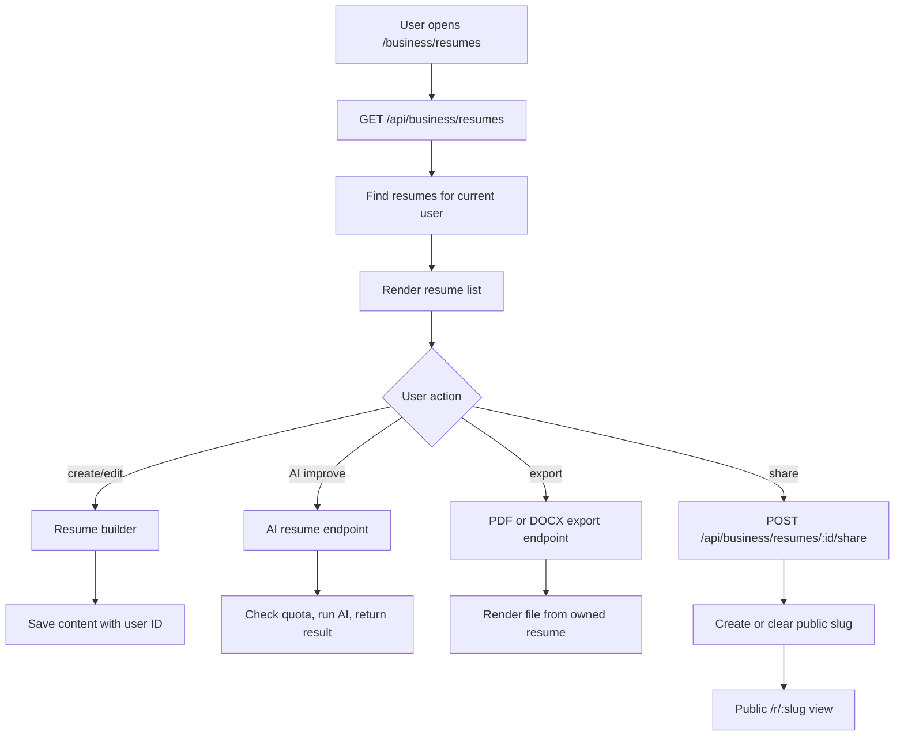

# Resumes

## Feature Description

Resumes let a user create, edit, duplicate, improve with AI, share publicly, and export resumes. Private resume management requires login. Public resume links use a share slug.

## Flowchart

## Main Files

| Area | Files |
|---|---|
| Pages | `client/src/pages/Resumes.tsx`, `client/src/pages/ResumeBuilderPage.tsx`, `client/src/pages/PublicResume.tsx` |
| Builder | `client/src/components/resume/builder/*`, `client/src/components/resume/templates/*` |
| AI helpers | `client/src/components/resume/ai/*`, `backend/src/services/resume/resume.ai.ts` |
| Exports | `backend/src/services/resume/pdfExporter.ts`, `backend/src/services/resume/docxExporter.ts` |
| Backend | `backend/src/routes/resume.routes.ts`, `backend/src/controllers/resume.controller.ts` |
| Model | `backend/src/models/Resume.model.ts` |

## Data Rules

- Private resume routes always find by resume ID and user ID.
- Public resume route only works when share is enabled.
- Disabling share clears the slug so old links stop working.
