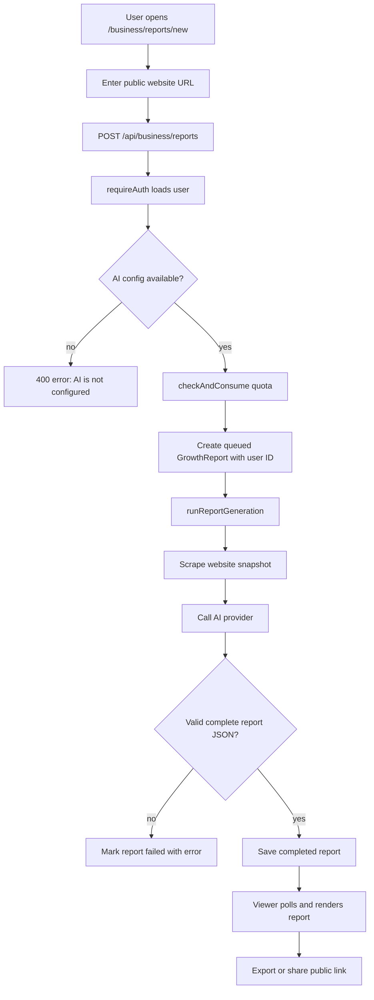

# Growth Reports

## Feature Description

Growth Reports creates AI-generated business growth reports from a public website URL. The backend validates the URL, creates a queued report owned by the user, scrapes the site, requires a configured AI provider, and saves completed report content. If AI is not configured or fails, the report returns an error instead of fake data.

## Flowchart

## Main Files

| Area | Files |
|---|---|
| Pages | `client/src/pages/business/ReportsListPage.tsx`, `NewReportPage.tsx`, `ReportViewerPage.tsx`, `client/src/pages/PublicReport.tsx` |
| Components | `client/src/components/business/reports/*` |
| Client API | `client/src/lib/reports.api.ts`, `client/src/lib/reports.queries.ts`, `client/src/lib/reports.exporters.ts` |
| Backend | `backend/src/routes/report.routes.ts`, `backend/src/routes/publicReport.routes.ts`, `backend/src/controllers/report.controller.ts` |
| Report services | `backend/src/services/report/*` |
| Model | `backend/src/models/GrowthReport.model.ts` |

## Data Rules

- Reports are owned by `user: req.user._id`.
- Private report reads, retries, deletes, and share toggles check owner.
- Public report links work only when sharing is enabled.
- Reports do not fall back to fake content.
