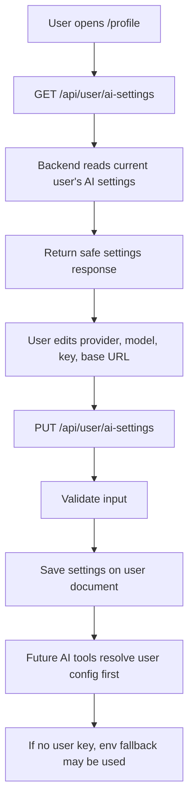

# Profile And AI Settings

## Feature Description

Profile lets a user view account details, theme preferences, and AI service settings. User AI settings can store provider, model, optional base URL, and API key. Environment-level AI fallback is intentionally only `AI_API_KEY`.

## Flowchart

## Main Files

| Area | Files |
|---|---|
| Page | `client/src/pages/Profile.tsx` |
| AI settings UI | `client/src/components/profile/AiSettingsCard.tsx` |
| Client hooks | `client/src/lib/queries.ts` |
| Backend routes/controller | `backend/src/routes/user.routes.ts`, `backend/src/controllers/user.controller.ts` |
| AI config | `backend/src/services/ai/config.ts`, `backend/src/config/ai.config.ts` |
| User model | `backend/src/models/User.model.ts` |

## Data Rules

- API keys are not returned in full to the client.
- User AI settings live on the user's document.
- AI config resolution prefers user settings, then admin/env fallback where configured.
