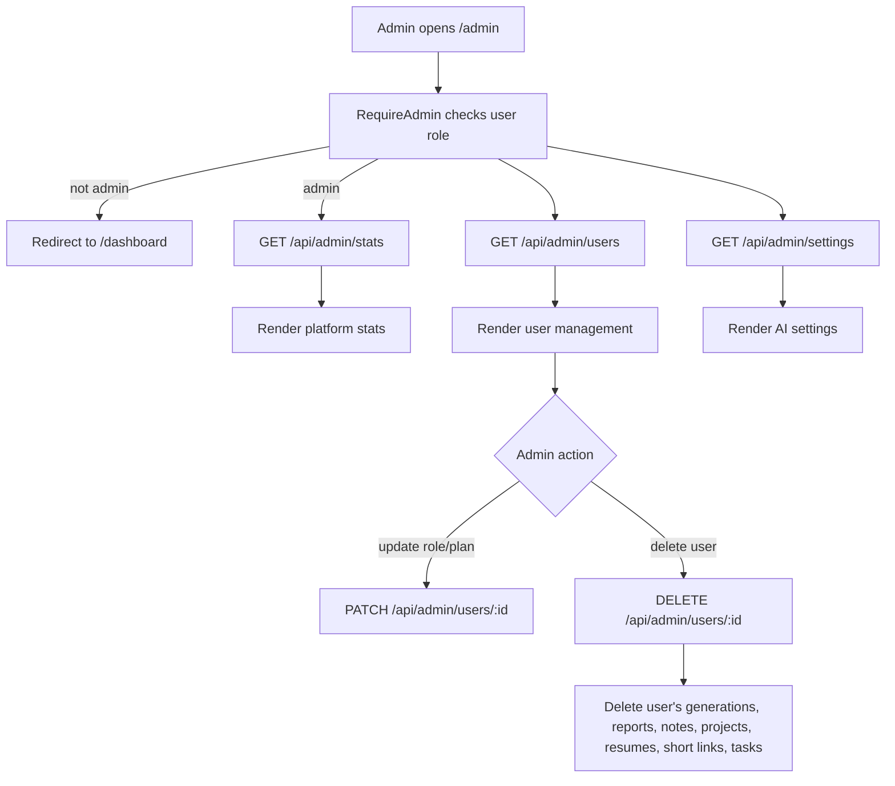

# Admin

## Feature Description

Admin lets admin users view stats, list users, update user roles/plans, delete users, and configure global AI settings. Only users with `role: "admin"` can open the page or use the admin API.

## Flowchart

## Main Files

| Area | Files |
|---|---|
| Page | `client/src/pages/Admin.tsx` |
| Client hooks | `client/src/lib/queries.ts` |
| Backend routes | `backend/src/routes/admin.routes.ts` |
| Backend controller | `backend/src/controllers/admin.controller.ts` |
| Settings model | `backend/src/models/Settings.model.ts` |

## Data Rules

- Admin page is blocked in the frontend by `RequireAdmin`.
- Admin API is protected by auth and admin middleware.
- Admin cannot delete their own account.
- User deletion cleans related user-owned data.
