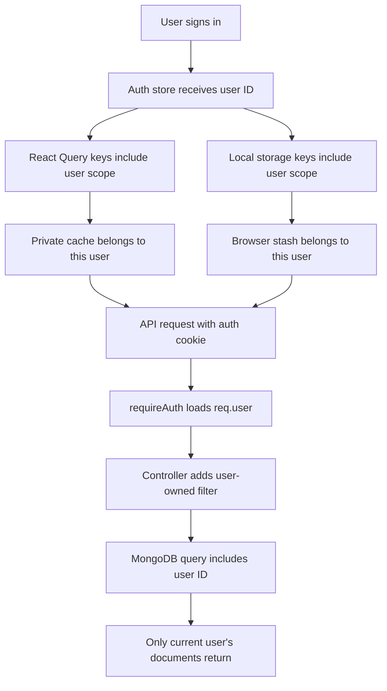

# Data Isolation

## Feature Description

Data isolation prevents one account from seeing another account's data. The app enforces this in frontend cache keys, local storage keys, auth-protected API routes, and MongoDB ownership filters.

## Flowchart

## Main Files

| Area | Files |
|---|---|
| Query scope | `client/src/lib/query-scope.ts` |
| Scoped local storage | `client/src/lib/user-storage.ts` |
| Auth store | `client/src/stores/auth.store.ts` |
| App auth/cache clearing | `client/src/App.tsx` |
| Backend auth | `backend/src/middleware/auth.middleware.ts` |
| User-owned controllers | `backend/src/controllers/business.controller.ts`, `resume.controller.ts`, `report.controller.ts`, `user.controller.ts` |

## Data Rules

- Private query roots are cleared on login, logout, auth failure, and user switch.
- Local stashes use `multitool.user.<userId>...`.
- Backend owner checks use `user: req.user._id`.
