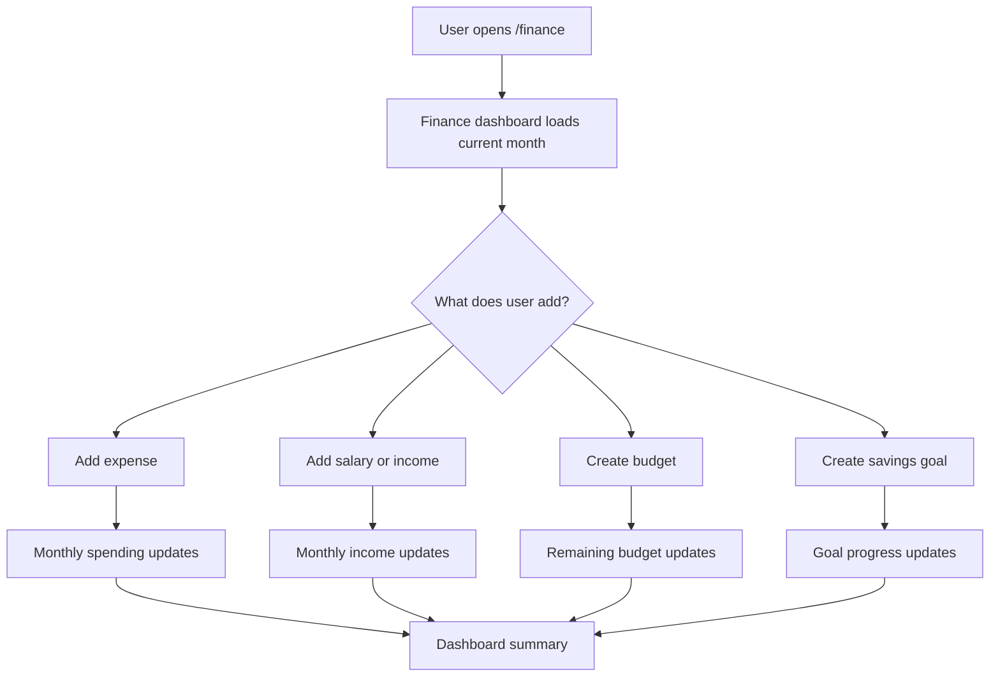
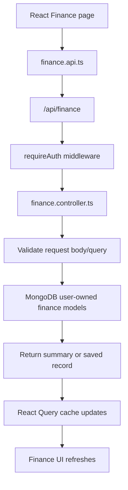
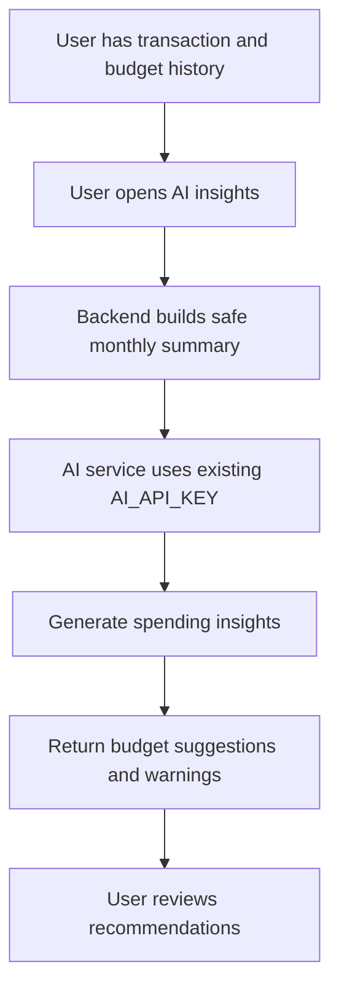

# Personal Finance App Roadmap

## Feature Description

Personal Finance is a new authenticated workspace inside the existing Multi Tool SaaS app. It is built for normal users who want a simple place to track daily expenses, salary or income, monthly budgets, and savings goals.

The product should start small and useful. Version 1 is not a banking app, tax app, or accounting system. It is a manual finance tracker that helps a user answer:

- How much money came in this month?
- How much did I spend?
- Where did I spend it?
- How much budget is left?
- Am I moving toward my savings goals?

## How Big We Are Building It

### V1: Core Tracker MVP

V1 should be big enough to feel like a real finance app, but small enough to build safely inside the current product.

Core features:

- Expense tracking for daily spending.
- Salary and income tracking.
- Monthly budget planning.
- Savings goals with progress.
- Multiple currency support, so `$`/USD is inactive unless the user chooses USD.
- Finance dashboard with monthly totals and recent activity.

V1 should avoid:

- Bank sync.
- UPI or card integrations.
- Tax filing.
- Complex accounting.
- AI-only workflows.

Manual entry is the first data input method. The user can add an expense or income item in under 30 seconds. The app should let each user choose a preferred display currency, and every money record should store its currency explicitly. Do not show `$` as the default symbol; only show `$` after the user selects USD.

### Phase Roadmap

| Phase | Goal | Features |
|---|---|---|
| Phase 1 | Manual finance tracker | Expenses, salary/income, budgets, savings goals, multi-currency display, dashboard |
| Phase 2 | Better tracking | Charts, recurring transactions, category settings, CSV import/export |
| Phase 3 | AI finance coach | Monthly summaries, budget suggestions, savings predictions, spending warnings |
| Phase 4 | Bigger product | Integrations, reminders, household budgets, premium insights |

## How We Push The App Bigger

The app gets bigger by improving the daily user loop first, then adding smart features after real data exists.

Growth ideas:

- Better onboarding: ask monthly salary, main spending categories, and first savings goal.
- Daily usage loop: quick "Add expense" button and recent transactions.
- Budget alerts: show when a category is near or over budget.
- Savings motivation: show how many months remain to reach each goal.
- Export and sharing: CSV export, PDF monthly reports, and optional shared household views.
- Premium finance insights: AI monthly report, category trends, and suggested budget changes.

The product should earn trust before adding automation. For money data, reliability matters more than fancy UI.

## Implementation Plan

### App Integration

Add Finance as a new authenticated workspace:

- Frontend route: `/finance`
- Backend API prefix: `/api/finance`
- Sidebar item: "Finance"
- Dashboard shortcut card: "Personal Finance"
- Optional workspace feature flag key: `finance`
- User finance setting: preferred display currency, such as INR, EUR, GBP, AED, CAD, AUD, JPY, USD, or other ISO currency codes.
- Currency selector in onboarding/settings; USD is not preselected unless the user chooses it.

Finance should follow the same user-owned data rules as business projects, notes, resumes, and reports. A user must never see another user's finance data.

### Starter Folder Structure

```text
client/src/pages/finance/
  FinanceDashboardPage.tsx
  TransactionsPage.tsx
  BudgetsPage.tsx
  SavingsGoalsPage.tsx

client/src/components/finance/
  FinanceSummaryCards.tsx
  TransactionDialog.tsx
  TransactionList.tsx
  BudgetCard.tsx
  SavingsGoalCard.tsx
  MonthSelector.tsx

client/src/lib/
  finance.api.ts
  finance.queries.ts

client/src/types/
  finance.ts

backend/src/models/
  FinanceTransaction.model.ts
  FinanceBudget.model.ts
  SavingsGoal.model.ts

backend/src/controllers/
  finance.controller.ts

backend/src/routes/
  finance.routes.ts

backend/src/validators/
  finance.validator.ts
```

### Backend Data Model

Recommended first models:

- `FinanceTransaction`
  - user
  - type: `expense` or `income`
  - amount
  - currency
  - category
  - date
  - note
  - source, optional for salary, freelance, cash, card, UPI, bank
- `FinanceBudget`
  - user
  - month
  - currency
  - category, optional for total monthly budget
  - limitAmount
- `SavingsGoal`
  - user
  - name
  - targetAmount
  - currentAmount
  - currency
  - targetDate, optional
  - status

Store money as `{ amount, currency }`, not as a formatted string. Formatting belongs in the frontend. This prevents `$` from being hardcoded into the database, API, or UI. The `$` symbol is inactive by default and must appear only for records or displays using `USD`.

### API Shape

Recommended first endpoints:

```text
GET    /api/finance/summary?month=YYYY-MM
GET    /api/finance/transactions?month=YYYY-MM&type=expense
POST   /api/finance/transactions
PATCH  /api/finance/transactions/:id
DELETE /api/finance/transactions/:id

GET    /api/finance/budgets?month=YYYY-MM
POST   /api/finance/budgets
PATCH  /api/finance/budgets/:id
DELETE /api/finance/budgets/:id

GET    /api/finance/savings-goals
POST   /api/finance/savings-goals
PATCH  /api/finance/savings-goals/:id
DELETE /api/finance/savings-goals/:id
```

All finance routes require auth. Every query must filter by `req.user._id`.

## Flowcharts

### User Finance Flow



### Backend Data Flow



### AI Finance Coach Flow



## How We Use AI Inside This App

AI is not required for V1. The finance app must be useful even when no AI key is configured.

AI should be added in Phase 3 after users have enough transactions, budgets, and savings goals. The backend should summarize finance data before sending it to AI, instead of sending unnecessary raw records.

Good AI features:

- Monthly spending summary.
- Budget recommendations.
- Savings goal prediction.
- Overspending warnings.
- "Where can I save money?" assistant.
- Subscription or recurring spending detection after recurring data exists.
- Currency-aware insights, where AI clearly mentions the user's selected currency.
- No AI output should assume dollars unless the selected currency is `USD`.

AI must use the app's existing single backend env key:

```env
AI_API_KEY=
```

AI output should be framed as guidance, not guaranteed financial advice.

## Test Plan

Backend tests:

- Create, list, update, and delete transactions.
- Income increases monthly income totals.
- Expenses increase monthly spending totals.
- Budgets calculate used and remaining amounts correctly.
- Savings goals calculate progress percentage correctly.
- Finance routes require auth.
- User-owned finance records are isolated by user.

Frontend tests:

- Finance dashboard renders an empty state.
- Adding an expense updates monthly spending.
- Adding salary or income updates monthly income.
- Currency selector changes displayed symbols and formatting.
- `$` is hidden/inactive unless USD is selected.
- Budget remaining amount displays correctly.
- Savings goal progress displays correctly.
- Month selector changes displayed totals.

Docs checks:

- Mermaid diagrams render.
- Starter folder structure matches current app conventions.
- Roadmap clearly separates V1, later growth, and AI phases.

## Acceptance Criteria

The roadmap is ready to implement when:

- The Finance workspace has a clear V1 scope.
- Backend models and routes are named.
- Frontend starter folders are named.
- User data ownership rules are explicit.
- Multi-currency storage and display are explicit, with no hardcoded `$`.
- USD/`$` is inactive by default and only appears when selected.
- AI is planned as a later enhancement using only `AI_API_KEY`.
- The diagrams explain user flow, backend flow, and AI flow.

## Assumptions

- Finance is built inside the existing Multi Tool SaaS app.
- V1 is the Core Tracker MVP.
- Manual entry is the first input method.
- AI finance features are Phase 3, not required for the first release.
- Currency is user-selectable from the first release. INR can be the recommended default, but `$`/USD must be inactive unless the user explicitly selects USD.
