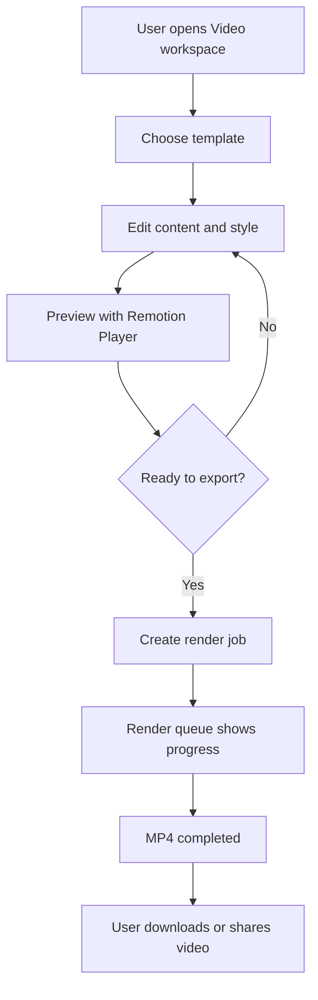
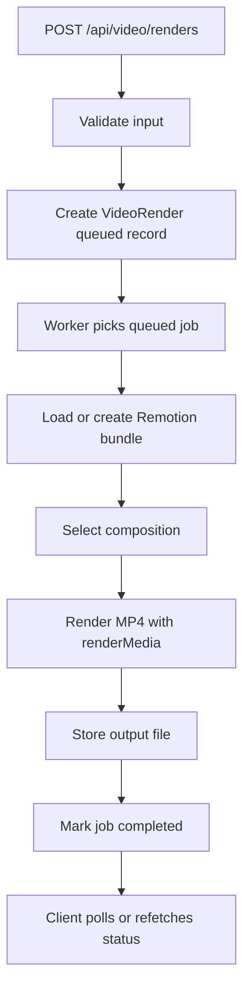
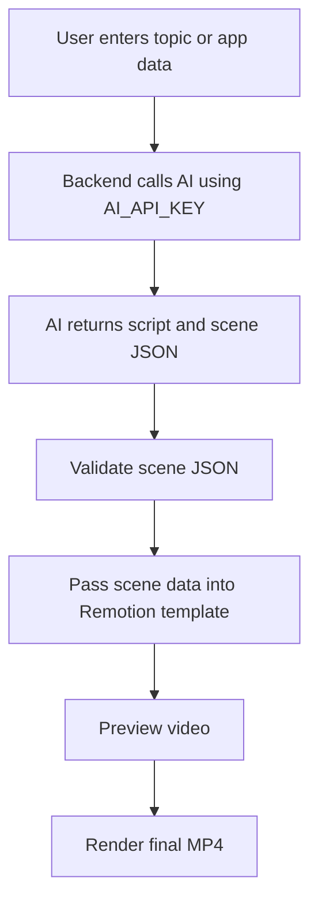

# Remotion Video Generation Roadmap

## Executive Summary

This document explains how to add a professional Remotion-powered video generation module to the Multi Tool SaaS app.

Remotion lets us build videos using React components. In this project, we will use it to turn app data and AI-generated content into real MP4 videos that users can preview, render, and download.

The recommended first release is a focused video module, not a full video editor. Users choose a template, enter content or generate content with AI, preview the video in the browser, then request a backend render job that exports an MP4 file.

## Product Goal

The goal is to create a video generation system that can support multiple future products:

- AI social media ad videos.
- Business report summary videos.
- Finance monthly recap videos.
- Resume introduction videos.
- Tool-result videos from existing AI tools.

The first version should prove the full video pipeline:

1. User selects a video template.
2. User edits text, colors, logo, and basic scene data.
3. User previews the video in the app.
4. User clicks "Render MP4".
5. Backend creates a render job.
6. Remotion renders the video.
7. User downloads or shares the finished video.

## Why Remotion

Remotion is a good fit because this app already uses React. Instead of learning a separate animation tool, we can define video scenes as React components and reuse existing frontend skills.

Benefits:

- React-based video templates.
- Dynamic videos from user data.
- Browser preview with `@remotion/player`.
- Server-side MP4 rendering with `@remotion/renderer`.
- Works well with AI-generated scripts, scenes, captions, and brand data.

Official references:

- [Remotion docs](https://www.remotion.dev/docs/)
- [Remotion Player](https://www.remotion.dev/docs/player)
- [renderMedia](https://www.remotion.dev/docs/renderer/render-media)
- [bundle](https://www.remotion.dev/docs/bundle)
- [License and pricing](https://www.remotion.dev/docs/license)

## Recommended V1 Scope

V1 should be a template-based video generator.

Included in V1:

- One or two polished video templates.
- Form-based scene editor.
- Browser preview.
- Backend render job creation.
- Render status tracking.
- MP4 download.
- User-owned render history.

Not included in V1:

- Timeline editor.
- Drag-and-drop video editor.
- Multi-track editing.
- Bank-grade media storage.
- Public marketplace for templates.
- Advanced collaboration.

This keeps the first release focused and realistic while still looking professional.

## Professional UI Plan

The UI should feel like a production video tool, not a demo page.

Main screens:

- Video Templates: grid of available templates with preview thumbnails.
- Create Video: form for title, script, colors, logo, aspect ratio, and call-to-action.
- Preview: embedded Remotion Player with play, pause, scrub, and template settings.
- Render Queue: status list for pending, rendering, completed, and failed renders.
- Video Detail: final MP4 preview, download button, metadata, and rerender option.

UI details:

- Use a clean dashboard layout inside the existing authenticated app shell.
- Use tabs for "Templates", "My Videos", and "Render Queue".
- Use cards only for template and render items.
- Use progress indicators for render status.
- Use clear empty states for no videos yet.
- Use icon buttons for preview, download, duplicate, and delete actions.
- Do not block the page while a video renders; rendering should run as a background job.

## Starter Folder Structure

```text
client/src/pages/video/
  VideoDashboardPage.tsx
  VideoTemplatesPage.tsx
  VideoCreatePage.tsx
  VideoRenderDetailPage.tsx

client/src/components/video/
  VideoTemplateCard.tsx
  VideoPreviewPlayer.tsx
  VideoSettingsPanel.tsx
  RenderStatusBadge.tsx
  RenderQueueList.tsx
  VideoDownloadCard.tsx

client/src/remotion/
  Root.tsx
  compositions/
    SocialAdVideo.tsx
    BusinessReportVideo.tsx
    FinanceMonthlyRecapVideo.tsx
    ResumeIntroVideo.tsx
  shared/
    BrandFrame.tsx
    CaptionBlock.tsx
    LogoReveal.tsx
    SceneTransition.tsx
  types.ts

client/src/lib/
  video.api.ts
  video.queries.ts

client/src/types/
  video.ts

backend/src/models/
  VideoRender.model.ts
  VideoTemplate.model.ts

backend/src/controllers/
  videoRender.controller.ts

backend/src/routes/
  videoRender.routes.ts

backend/src/services/video/
  remotionBundle.service.ts
  remotionRender.service.ts
  videoStorage.service.ts
  videoPrompt.service.ts

backend/src/validators/
  videoRender.validator.ts
```

## Packages To Add

Client:

```text
remotion
@remotion/player
```

Backend:

```text
@remotion/bundler
@remotion/renderer
```

Important: all Remotion packages should use the same exact version.

## Data Model

### VideoRender

Stores one user-owned render job.

Recommended fields:

- user
- templateId
- title
- status: `queued`, `rendering`, `completed`, `failed`
- inputProps
- durationInFrames
- fps
- width
- height
- codec
- progress
- outputUrl
- thumbnailUrl
- errorMessage
- createdAt
- updatedAt

### VideoTemplate

Stores available templates.

Recommended fields:

- templateId
- name
- description
- category
- aspectRatio
- defaultProps
- thumbnailUrl
- enabled

Templates can start as code constants. A database model is useful later when admins need to enable, disable, or edit templates.

## API Shape

```text
GET    /api/video/templates
GET    /api/video/renders
POST   /api/video/renders
GET    /api/video/renders/:id
DELETE /api/video/renders/:id
GET    /api/video/renders/:id/download
POST   /api/video/renders/:id/rerender
```

All routes require authentication. Every render must be scoped to the current user.

Render creation body:

```json
{
  "templateId": "finance-monthly-recap",
  "title": "May 2026 Finance Recap",
  "inputProps": {
    "headline": "Your monthly spending summary",
    "scenes": [],
    "brandColor": "#2563eb"
  },
  "format": {
    "width": 1080,
    "height": 1920,
    "fps": 30
  }
}
```

## Flowcharts

### User Flow



### Backend Render Flow



### AI To Video Flow



## How We Use AI

AI should prepare structured video content. Remotion should render that content.

Good AI responsibilities:

- Generate video scripts.
- Split a script into scenes.
- Suggest captions.
- Create short calls-to-action.
- Summarize finance or business data.
- Produce template-safe JSON input props.

Bad AI responsibilities:

- Rendering the video directly.
- Returning unvalidated layout code.
- Making financial or business claims without source data.
- Deciding file paths or backend storage details.

AI must use the existing backend key:

```env
AI_API_KEY=
```

The backend should validate AI output before passing it into Remotion.

## Rendering Strategy

Use a background job model.

Recommended V1 approach:

- Backend creates a queued render record.
- A worker process renders one job at a time.
- Client polls render status.
- Completed MP4 files are stored in a local uploads folder for development.
- Production storage can later move to S3, Cloudinary, or another object storage provider.

Do not render long videos directly inside the request-response cycle. Video rendering can be slow and should not block an HTTP request.

Bundle strategy:

- Create the Remotion bundle when source code changes or when the server starts.
- Reuse the same bundle for many renders.
- Do not call `bundle()` for every video render.

## Deployment Notes

Remotion rendering needs a server environment that can run Chromium and FFmpeg. For production, plan a separate render worker if possible.

Recommended deployment path:

1. Local development render worker.
2. Single backend worker for low-volume testing.
3. Dedicated render worker for production.
4. Cloud rendering or serverless rendering later if render volume grows.

Before commercial use, confirm the Remotion license requirements for the team and product.

## Security And Ownership

Rules:

- Every render belongs to one user.
- Users can only list, download, or delete their own renders.
- Validate template IDs against a known allowlist.
- Validate `inputProps` with Zod before rendering.
- Limit video duration, resolution, and render frequency.
- Sanitize user-provided text shown in video templates.
- Never expose server file paths to the client.

## Test Plan

Backend tests:

- Create render job requires authentication.
- User cannot access another user's render.
- Invalid template ID is rejected.
- Invalid `inputProps` is rejected.
- Failed render stores error status.
- Completed render returns a download URL.

Frontend tests:

- Template grid renders.
- Preview renders with default props.
- Create page validates required fields.
- Render queue shows queued, rendering, completed, and failed states.
- Download button appears only for completed renders.

Manual QA:

- Render one short portrait video.
- Render one landscape video.
- Confirm output MP4 opens locally.
- Confirm rerender creates a new job or updates status predictably.

## Acceptance Criteria

The Remotion module is ready for V1 when:

- Users can preview at least one template in the browser.
- Users can create a render job from the UI.
- Backend renders an MP4 using Remotion.
- Render status is visible in the UI.
- Completed videos can be downloaded.
- Render records are user-owned and isolated.
- AI-generated scene data is validated before rendering.

## Supervisor Demo Script

Use this demo flow:

1. Open the Video workspace.
2. Choose "Finance Monthly Recap" or "Social Ad Video".
3. Enter a title, brand color, and short content.
4. Click preview and show the Remotion Player.
5. Click "Render MP4".
6. Show the render queue moving from queued to completed.
7. Download and play the generated MP4.

This demonstrates the full product idea: React-based templates, AI-ready data, backend rendering, and a professional user workflow.
