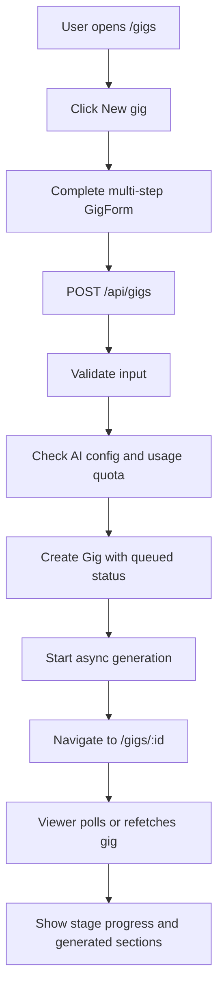
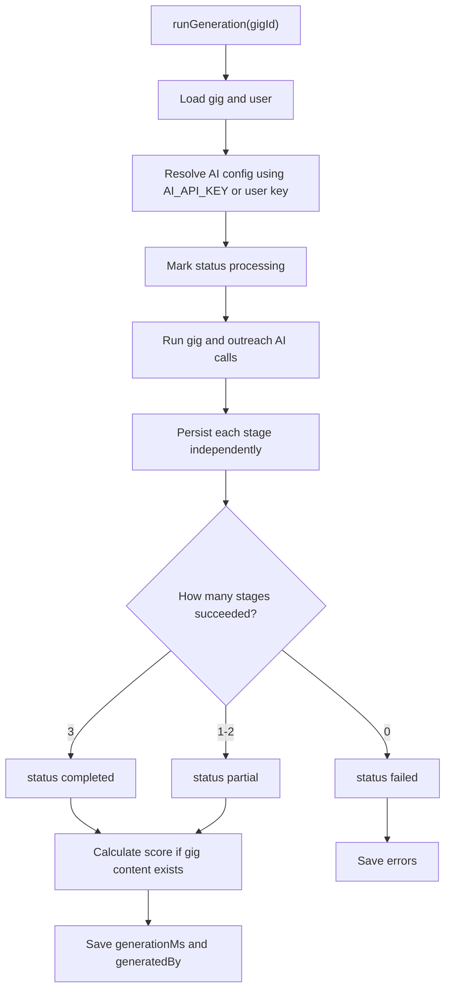
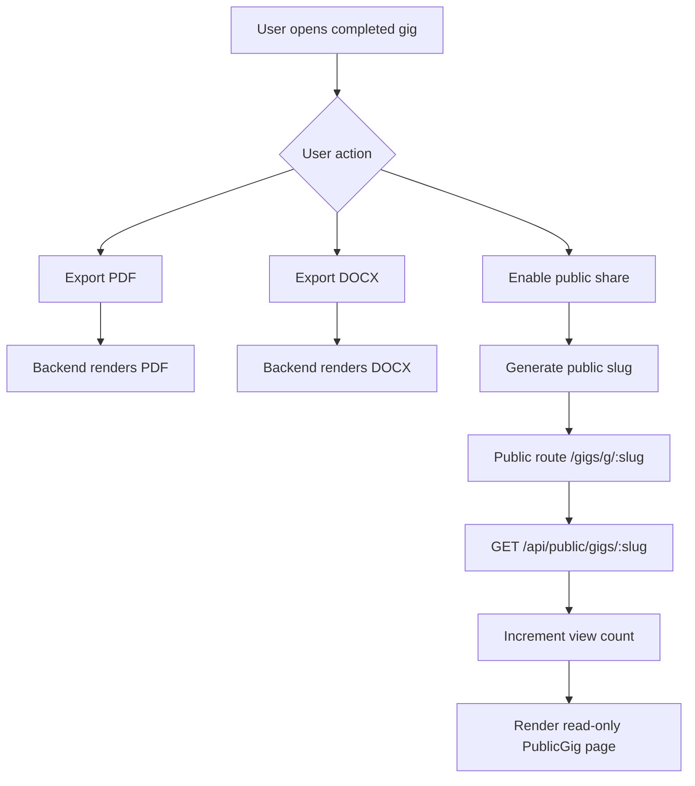

# Gig Builder

## Feature Description

Gig Builder is an authenticated workspace for creating freelancer service listings for platforms like Fiverr, Upwork, LinkedIn, Instagram, and Freelancer.

The feature helps a user turn a service idea into a complete marketplace-ready gig package. It generates:

- Gig title and alternative titles.
- SEO tags and keywords.
- Marketplace-style description.
- Basic, Standard, and Premium packages.
- Buyer requirements.
- FAQs.
- Add-on services.
- Thumbnail concept and image prompt.
- Portfolio sample ideas.
- Outreach messages for email, Instagram, LinkedIn, follow-up, and proposals.
- A conversion score with improvement suggestions.

The feature is designed for freelancers, agencies, creators, and service sellers who want a faster way to package and publish their offer.

## What Changed

This feature adds a new Gigs section to the app:

- Authenticated routes for gig library, new gig creation, and gig viewer.
- Public share route for published gig pages.
- Backend gig model, routes, controller, validators, AI orchestration, scoring, PDF export, and DOCX export.
- React Query client API for listing, creating, improving, sharing, duplicating, exporting, and viewing gigs.
- Multi-step gig input form.
- Gig viewer with sections for title, packages, description, FAQs, outreach, thumbnail ideas, portfolio ideas, and score.

## User Workflow

1. User opens `Gigs` from the sidebar.
2. User clicks `New gig`.
3. User completes a multi-step form:
   - Service basics.
   - Target audience and niche.
   - Delivery format and tools.
   - Pricing and currency.
   - Review and submit.
4. Backend creates a queued gig record.
5. AI generation runs asynchronously in two active stages:
   - Gig content.
   - Outreach messages.
6. User lands on the gig viewer page.
7. The viewer shows progress while generation is running.
8. Completed sections appear as each stage finishes.
9. User can improve sections, duplicate, regenerate, export, share, or delete the gig.

## Frontend Files

Main pages:

```text
client/src/pages/gigs/
  GigsLibrary.tsx
  NewGigPage.tsx
  GigViewerPage.tsx

client/src/pages/
  PublicGig.tsx
```

Main components:

```text
client/src/components/gigs/
  GigCard.tsx
  GenerationProgressView.tsx
  GigExportMenu.tsx
  GigShareDialog.tsx
  GigStatusPill.tsx
  PlatformBadge.tsx

client/src/components/gigs/form/
  GigForm.tsx
  StepIndicator.tsx
  platformOptions.ts
  steps/

client/src/components/gigs/viewer/
  GigViewer.tsx
  GigHeader.tsx
  ImproveSectionDialog.tsx
  ScoreBreakdown.tsx
  sections/
```

Client data layer:

```text
client/src/lib/
  gigs.api.ts
  gigs.queries.ts
  gigs.exporters.ts

client/src/types/
  gigs.ts
```

## Backend Files

```text
backend/src/models/
  Gig.model.ts

backend/src/controllers/
  gig.controller.ts

backend/src/routes/
  gig.routes.ts
  publicGig.routes.ts

backend/src/services/gig/
  orchestrator.ts
  generator.ts
  prompts.ts
  scorer.ts
  pdfExporter.ts
  docxExporter.ts

backend/src/validators/
  gig.validator.ts
```

## API Shape

Authenticated routes:

```text
GET    /api/gigs
POST   /api/gigs
GET    /api/gigs/:id
PATCH  /api/gigs/:id
DELETE /api/gigs/:id
POST   /api/gigs/:id/regenerate
POST   /api/gigs/:id/improve
POST   /api/gigs/:id/duplicate
POST   /api/gigs/:id/share
GET    /api/gigs/:id/export/pdf
GET    /api/gigs/:id/export/docx
```

Public route:

```text
GET /api/public/gigs/:slug
```

Frontend routes:

```text
/gigs
/gigs/new
/gigs/:id
/gigs/g/:slug
```

## Data Model

Main model: `Gig`

Important fields:

- `user`: owner of the gig.
- `title`: display title.
- `input`: original form input.
- `content.gig`: generated gig listing.
- `content.outreach`: generated outreach messages.
- `score`: deterministic score and suggestions.
- `status`: `queued`, `processing`, `partial`, `completed`, or `failed`.
- `generationStages`: per-stage status for gig and outreach. The legacy `leads` stage remains for backward compatibility but is not generated or displayed.
- `generatedBy`: `ai`, `mock`, or `null`.
- `generationMs`: generation time.
- `share.enabled`: public sharing flag.
- `share.slug`: public slug.
- `share.viewCount`: public page view count.
- `archived`: soft library state.

## Flowchart

### Gig Creation Flow



### Backend AI Orchestration Flow



### Share And Export Flow



## Working Description

The feature uses a fire-and-forget generation pattern. When the user submits the form, the API immediately creates a queued gig record and returns a `gigId`. The frontend navigates to the viewer page while the backend keeps working in the background.

The orchestrator runs two active AI tasks:

- Generate the core gig listing.
- Generate outreach messages.

Each task is saved independently. This means one failed AI step does not destroy the whole gig. If both active stages pass, the gig becomes `completed`. If only one passes, it becomes `partial`. If both fail, it becomes `failed`.

The viewer page can show partial results, progress, and failed stage messages. This is useful because AI calls can fail independently.

## AI Usage

Gig generation requires AI. The backend checks for AI config before creating or regenerating gigs.

AI is used for:

- Core gig copy.
- Package generation.
- Outreach messages.
- Section improvement.

AI is not used for lead finding. The system must not generate search queries, lead lists, or customer-finding guarantees.

AI must use the existing app setup:

```env
AI_API_KEY=
```

The backend should keep validating input and output so the UI receives predictable data.

## Export And Sharing

Export features:

- PDF export for polished sharing or printing.
- DOCX export for editing outside the app.

Sharing features:

- User can enable public sharing.
- Backend creates a unique slug.
- Public page is read-only.
- Public views increment `share.viewCount`.
- Disabling share removes the public slug.

## Checks For The New Changes

Use this checklist when reviewing the feature:

- `/gigs` opens the authenticated gig library.
- `/gigs/new` opens the multi-step gig form.
- Submitting a valid form creates a queued gig.
- Missing AI config shows a useful error.
- Gig viewer shows generation progress.
- Completed gig shows title, packages, description, FAQs, outreach, thumbnail ideas, portfolio ideas, and score.
- Improve section works only after required content exists.
- Duplicate creates a new queued gig.
- Regenerate is blocked while generation is already running.
- Share creates a public URL.
- Public page is read-only and increments views.
- PDF and DOCX exports download successfully.
- Users cannot access gigs owned by another user.

## Data Rules

- Every gig belongs to one user.
- Authenticated routes must filter by current user.
- Public route only returns shared gigs.
- Public route must not expose private owner data.
- AI generation consumes usage quota.
- Export routes require ownership.
- Share slugs must be unique.

## Acceptance Criteria

The feature is ready when:

- A user can create, view, improve, duplicate, regenerate, share, export, and delete gigs.
- Generation status is clear for queued, processing, partial, completed, and failed states.
- Stage-level failures are visible and do not break completed stages.
- Public sharing works through `/gigs/g/:slug`.
- PDF and DOCX exports use the saved gig content.
- Data ownership is enforced on every private route.
