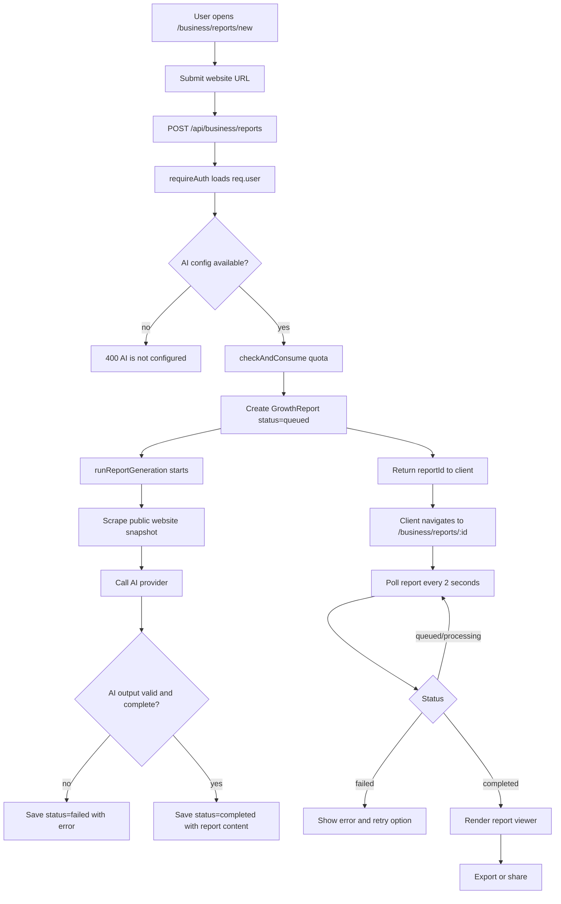
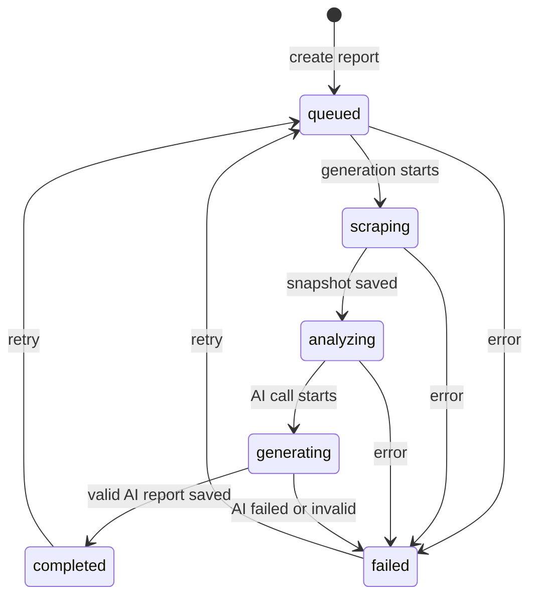
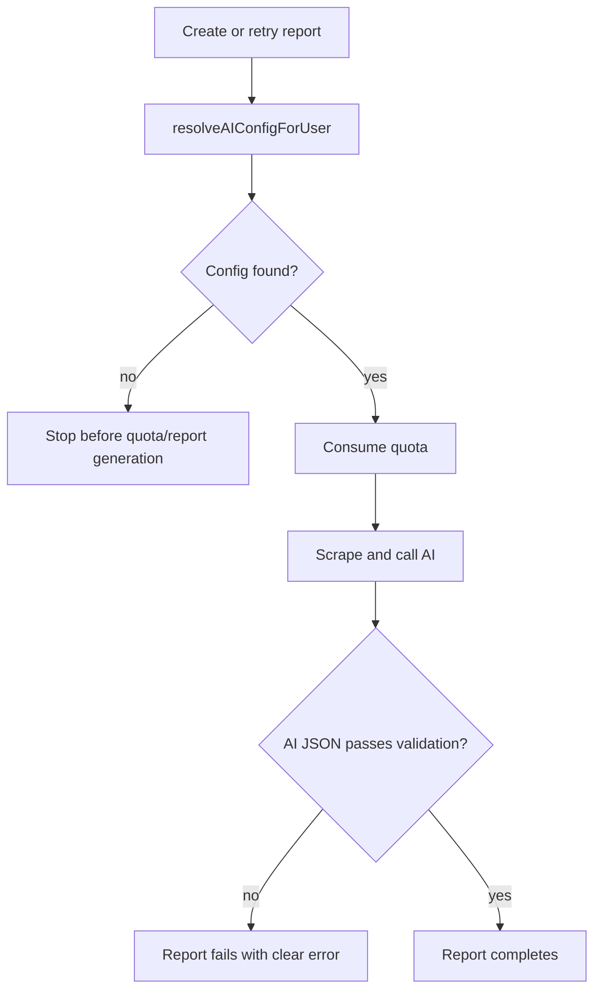
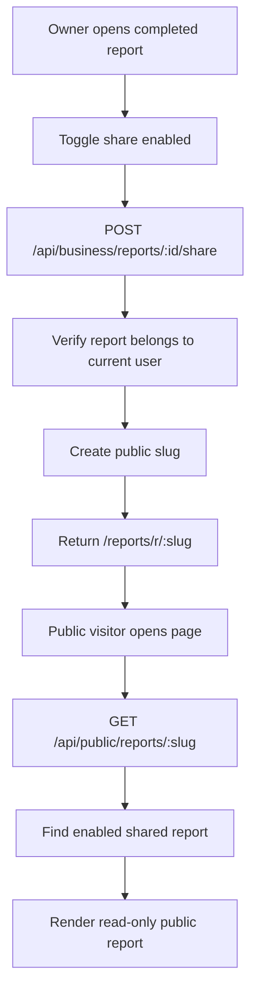
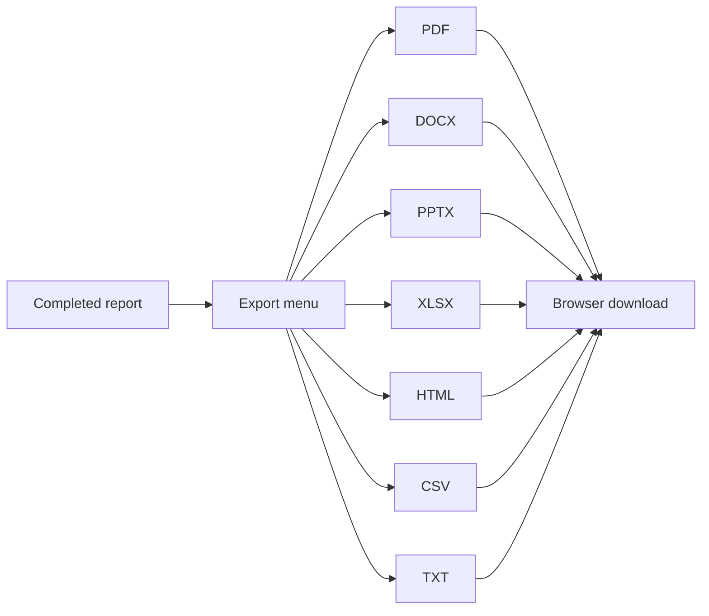

# Growth Reports Architecture

Growth Reports lives inside Business Management. A logged-in user enters a public website URL, the backend creates a user-owned report job, scrapes the page, calls the configured AI provider, validates the AI JSON, and stores the completed report. If AI is not configured, fails, or returns incomplete data, the user gets an error. The system does not create fake fallback reports.

For the short per-feature doc, see [features/12-growth-reports.md](./features/12-growth-reports.md).

## End-To-End Flow

## Status Flow

## Main Files

| Area | Files |
|---|---|
| Frontend pages | `client/src/pages/business/ReportsListPage.tsx`, `NewReportPage.tsx`, `ReportViewerPage.tsx`, `client/src/pages/PublicReport.tsx` |
| Frontend components | `client/src/components/business/reports/*` |
| Client data/export | `client/src/lib/reports.api.ts`, `client/src/lib/reports.queries.ts`, `client/src/lib/reports.exporters.ts` |
| Backend routes | `backend/src/routes/report.routes.ts`, `backend/src/routes/publicReport.routes.ts` |
| Backend controller | `backend/src/controllers/report.controller.ts` |
| Backend services | `backend/src/services/report/index.ts`, `scraper.ts`, `generator.ts`, `prompts.ts` |
| Model/validator | `backend/src/models/GrowthReport.model.ts`, `backend/src/validators/report.validator.ts` |

## AI Requirement

The report generator validates that AI output includes:

- Valid report sections.
- Valid score values.
- At least five monetization streams.
- Valid setup effort values.
- Required summary and recommendation content.

## Public Sharing

## Export Flow

## Data Rules

- Every report stores `user: req.user._id`.
- Private report reads, updates, retries, deletes, and share actions always check owner.
- Public reports only load through an enabled share slug.
- Disabling share clears the slug, so old public links stop working.
- Admin user deletion removes that user's Growth Reports.
